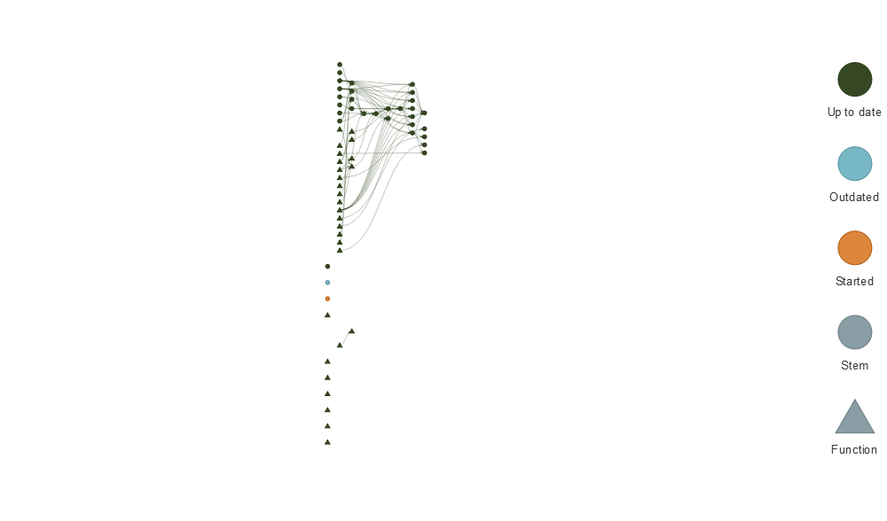

# Translation Elicitation

More info in the Open Science Framework repository.

## How to make this repository work on your local machine
There are two possibilities to reproduce the computational environment of this study: (a) Using the Docker image (recommended), (b) manual setup.

### Docker setup

1) Install [Docker Desktop](https://docs.docker.com/engine/install/) in your local machine. (You may have to restart your machine after installation).
2) Open Docker Desktop. In the search bar (Ctrl+K or cmd+K), search `gongcastro/translation-elicitation` and click "Run".
4) Open a terminal and run the following command:

```bash
docker run --rm -ti \
    -e ROOT=true \
	-e PASSWORD=rstudio \
    -p 8787:8787 \
    --name rstudio gongcastro/translation-elicitation:latest
```
5) Open a browser and navigate to [http://localhost:8787](http://localhost:8787). A login page will show up. Use "rstudio" as username. You will find the passsword printed in the terminal.
6) After login, you will see an RStudio session in which you can run `make()` to run the code and get all outputs.

### Manual setup

#### 1. Downloading the repository

You can either download the project as a .zip file by clocking on the
green button that says “Code”, or if you feel comfortable with Git, you
can clone the repository from your console running:

``` bash
git clone https://github.com/gongcastro/translation-elicitation.git
```

#### 2. Setting up R packages with renv

We used the R package renv to keep track of the dependencies of the
project. renv allows to install and update the R packages necessary to
run the project in a project-specific environment. Packages installed
using renv in this project will only be installed or updated in the
context of this project. The R packages you had installed for other
projects will remain unaffected.

1.  Open this project in a new RStudio session (open the project folder
    and click on the `translation-elicitation.Rproj` file).
2.  In the R console, run the following lines of code:

``` r
# install.packages("renv") # in case yopu need to install renv
renv::activate() # this will create the renv infrastructure if missing
renv::restore() # this will install/update/move the necessary R pakcages into this project
```

#### 3. Running the code with targets

Restart your R session. The code in the .Rprofile file should run at
start, and define the function `make()`. You should be able to run
`make()` in your console. This will run all lines of code in the right
order, and will generate all objects and outputs (e.g., data frames)
used in the project, and render the manuscript.

Here are some details about the code, in case you want to dive into it.
We use the targets package to keep track of what code should be run, and
in what order. The `_targets.R` script contains the main commands in the
workflow. Each command is indicated inside of a call to the
`tar_target()` function, and is called a *target*. For readability, we
have defined most of the functions used inside the targets on separate
scripts, hosted in the R/ folder of the project. Take a look at them if
you want to see what exactly what happens inside those function.

You can import the objects generated by the targets using the
`tar_load()` function. First, load all necessary R packages running
`tar_load_globals()`. Then, if you have previously run `make()`, you can
run `tar_load(responses)` to get the main data set or
`tar_load(model_fits)` to inspect the models, for instance. You don’t
have to assign the call to the `tar_load()` function to a variable: the
object will be directly save as a variable in your workspace.

    ## Run make() to update the project
    ## Run tar_load_all() to load all built targets
    ## Warning message:
    ## Project requested R version '4.2.0' but '4.0.5' is currently being used 

<!-- -->

## How is this repository organised?

This repository is organised as follows:

- **data-raw**: raw data from the behavioural task in Experiments 1, 2, and 3.
- **data**: processed and manually coded data.
- **manuscript**: Quarto documents for the manuscript and appendix.
- **results**: outputs of the models.
- **R**: R code used to process and analyse the data.
- **stimuli**: stimuli and trial lists used in the behavioural task.

The file `.gitignore` indicates Git what files/subfolders must *not* be
kept track of (for privacy and storage limit, e.g., audios).

The experimental set up and code (PsychoPy/Pavlovia) are stored in the
following GitLab repositories:

-   Version in Catalan for **Spanish speakers**:
    <https://gitlab.pavlovia.org/gongcastro/translationelicitationspa>
-   Version in Spanish or Catalan for **English speakers**:
    <https://gitlab.pavlovia.org/SiowSerene/translationelicitation_eng>
