# Experimental task

## Methods

### Participants

We collected data from June 04th 2020 to June 28th 2020. We tested 104
participants. 36 were English natives tested in Spanish, 37 were English
natives tested in Catalan, and 32 were Spanish natives tested in
Catalan. 14 failed to meet all the inclusion criteria and were excluded
from further analyses. The final sample comprised data from 14
participants, 28 in the ENG-SPA group, 34 in the ENG-CAT group, and 29
in the SPA-CAT group.

Participants were included if[1]:

-   Aged 18 to 25 years
-   Did not report being fluent in Catalan, Spanish, or Italian
-   Provided at least 80% of the presented trials
-   Did not report motor, auditory or visual (other than wearing
    glasses) problems

Trials were considered valid if:

-   Participant did not leave a blank response
-   Participant took longer than 10 seconds to respond

#### Summary

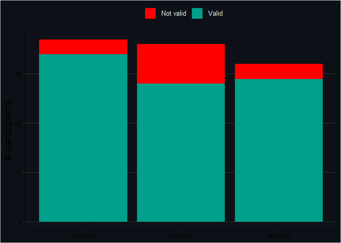

#### Valid trials

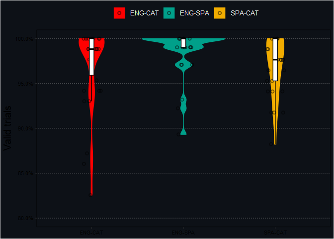

#### Demographic information

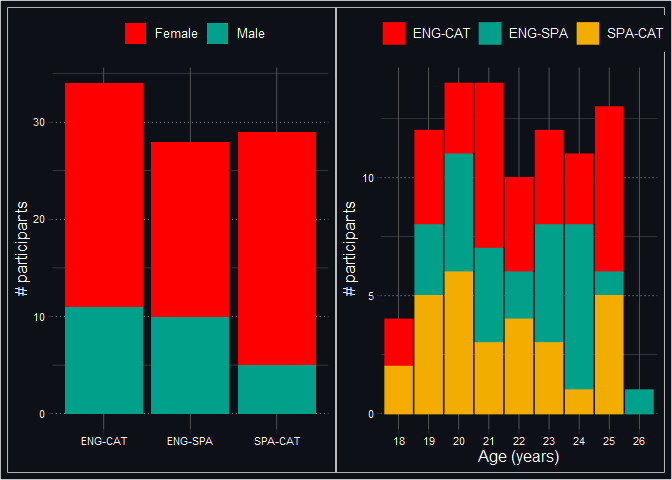

#### Second language

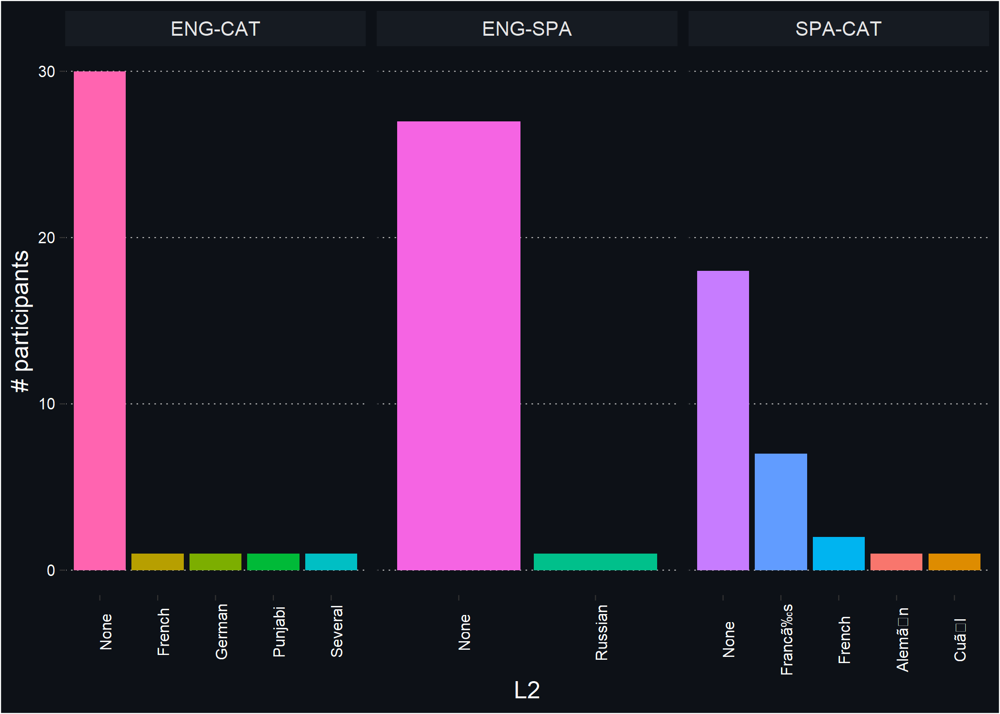

#### Language profile proficiency

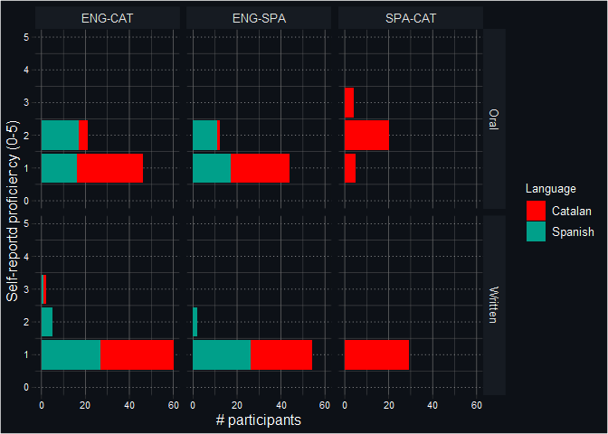

#### 

### Stimuli

Participants in the ENG-SPA listened to 103 Spanish words, and
participants in the ENG-CAT and the SPA-CAT groups listened to 86
trials. Five trials in each condition were practice trials and were
excluded from analyses.

#### Lexical frequency

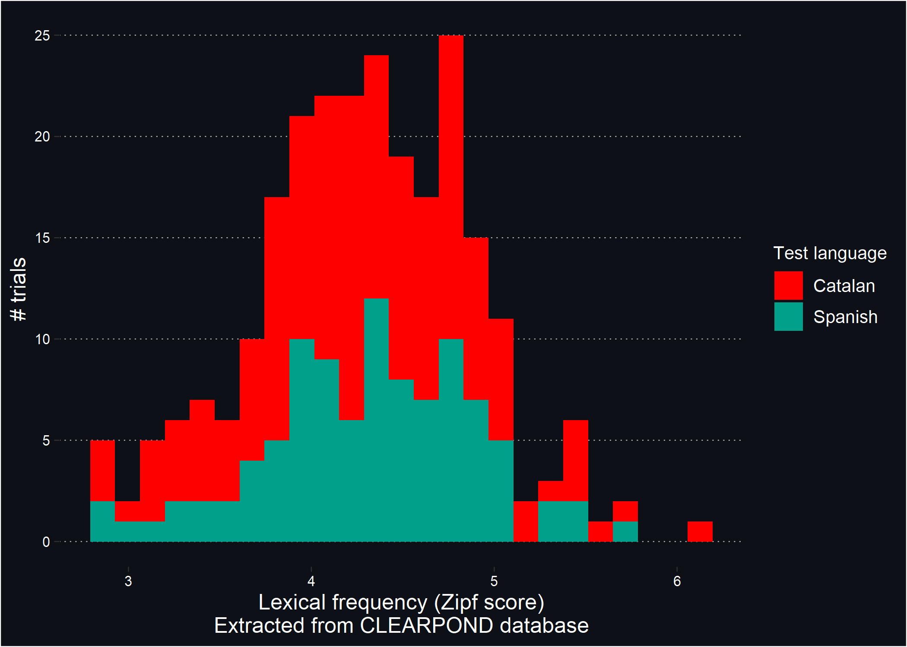

#### PTHN

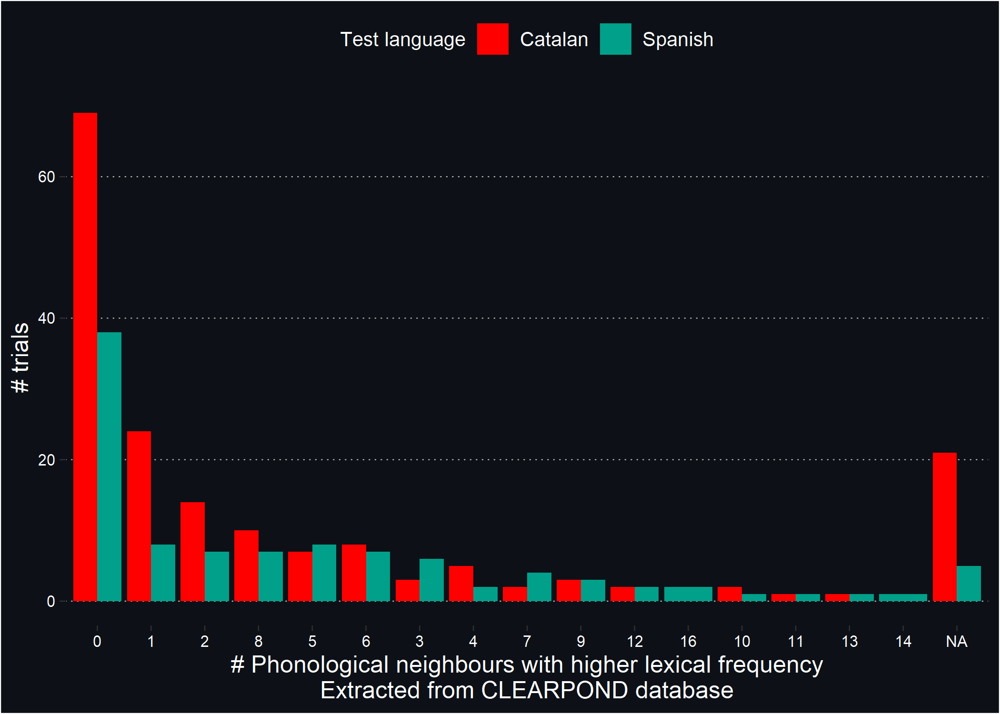

#### Phonological similarity

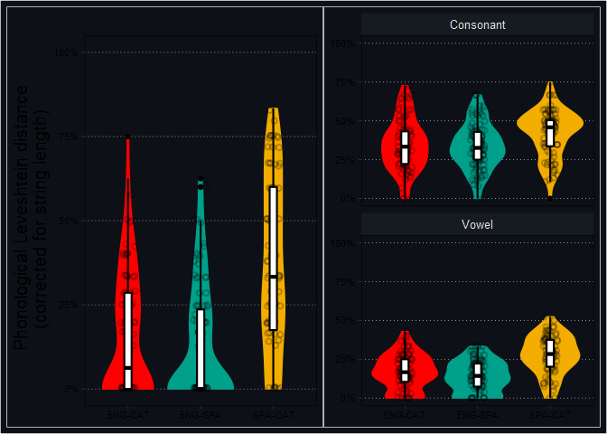

#### Phonological onset

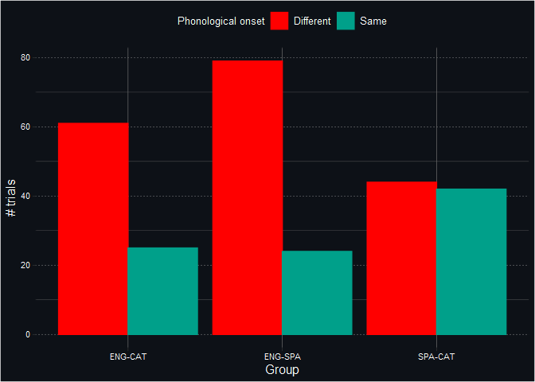

#### Phonological similarity and onset

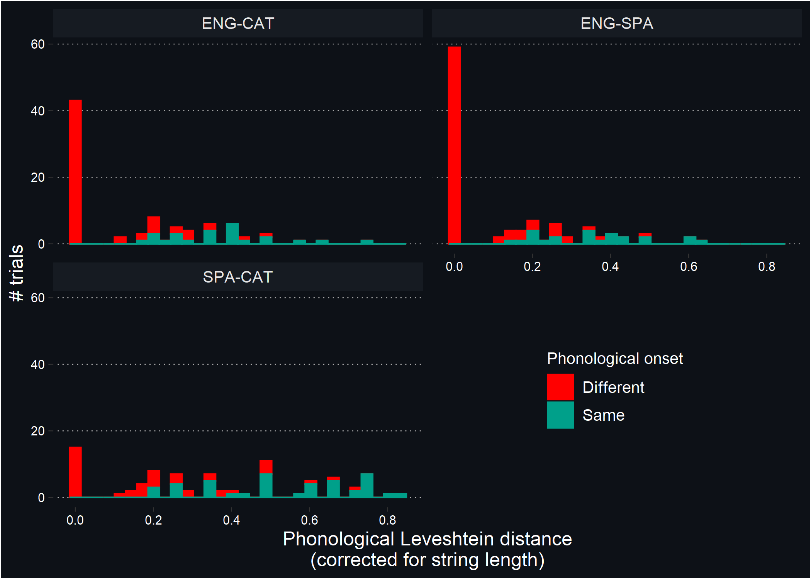

#### 

### Design

### Data analysis

#### Model details

We fitted a Bayesian multilevel regression model using the R package
`brms` (Bürkner 2017), with correct responses (`correct`, 0 is incorrect
response, 1 if correct response) as the response variable with a
Bernoulli distribution and a logit link function. We modelled the
probability of an average participant providing a correct response,
conditional to a set of predictors (aka. fixed effects) and their
interactions:

-   PTHN (`pthn`, 0-Inf): number of phonological neighbours with higher
    frequency of the target word. Extracted from the CLEARPOND database.
    Standardised before entering the regression model.
-   Phonological similarity (`lv`, 0-1): Inverse Levenshtein distance
    between the IPA transcription of the presented word and its correct
    translation in the target language, calculated using the
    `stringdist` function of the `stringdist` package (van der
    Loo 2014). Standardised before entering the regression model.
-   Shared phonological onset (`onset`, Same/Different): Whether the
    presented and the target word share phonological onset, as judged by
    experimenters, and sum coded as *D**i**f**f**e**r**e**n**t* =  − 0.5
    and *S**a**m**e* =  + 0.5.

We added participants (`participants`) and as a grouping variable (aka.,
random effects), therefore adding participant-level adjustments to the
model. We specified random intercepts slopes for all fixed effects
within the `participant` grouping variable.

We performed multiple imputation via predictive mean matching using the
`mice` function of the `mice` package (van Buuren and
Groothuis-Oudshoorn 2011) to impute missing values in the response
variable or the predictors.

The model was implemented using the following formula (`fit_3`):

    ~ pthn*lv*onset + (1 + pthn*lv*onset | participant)

The estimation of the model was performed using Bayesian inference via
Hamiltonian Monte-Carlo in Stan (Carpenter et al. 2017), with 4 chains,
2,000 iterations each (1,000 warmups). The output of this model is the
approximated posterior distribution of all the parameters estimated,
therefore indicating the probability of each combination of values of
the parameters, conditional to the observed data.

We compared this (extended model) to other models dropping one predictor
at a time using Leave-one-out cross-validation (LOO-CV), using the `loo`
and `loo_compare` functions of the `brms` package. We compared our
extended model against the following models:

-   fit_0: `~ 1 + frequency + (1  | participant)`
-   fit_1: `~ 1 + frequency + pthn + (1 + pthn | participant)`
-   fit_2: `~ 1 + frequency + pthn*lv + (1 + pthn*lv | participant)`

#### Stan code

Stan code generated by `brms`:

``` stan
// generated with brms 2.15.0
functions {
/* compute correlated group-level effects
* Args: 
*   z: matrix of unscaled group-level effects
*   SD: vector of standard deviation parameters
*   L: cholesky factor correlation matrix
* Returns: 
*   matrix of scaled group-level effects
*/ 
matrix scale_r_cor(matrix z, vector SD, matrix L) {
// r is stored in another dimension order than z
return transpose(diag_pre_multiply(SD, L) * z);
}
}
data {
int<lower=1> N;  // total number of observations
int Y[N];  // response variable
int<lower=1> K;  // number of population-level effects
matrix[N, K] X;  // population-level design matrix
// data for group-level effects of ID 1
int<lower=1> N_1;  // number of grouping levels
int<lower=1> M_1;  // number of coefficients per level
int<lower=1> J_1[N];  // grouping indicator per observation
// group-level predictor values
vector[N] Z_1_1;
vector[N] Z_1_2;
vector[N] Z_1_3;
vector[N] Z_1_4;
int<lower=1> NC_1;  // number of group-level correlations
int prior_only;  // should the likelihood be ignored?
}
transformed data {
int Kc = K - 1;
matrix[N, Kc] Xc;  // centered version of X without an intercept
vector[Kc] means_X;  // column means of X before centering
for (i in 2:K) {
means_X[i - 1] = mean(X[, i]);
Xc[, i - 1] = X[, i] - means_X[i - 1];
}
}
parameters {
vector[Kc] b;  // population-level effects
real Intercept;  // temporary intercept for centered predictors
vector<lower=0>[M_1] sd_1;  // group-level standard deviations
matrix[M_1, N_1] z_1;  // standardized group-level effects
cholesky_factor_corr[M_1] L_1;  // cholesky factor of correlation matrix
}
transformed parameters {
matrix[N_1, M_1] r_1;  // actual group-level effects
// using vectors speeds up indexing in loops
vector[N_1] r_1_1;
vector[N_1] r_1_2;
vector[N_1] r_1_3;
vector[N_1] r_1_4;
// compute actual group-level effects
r_1 = scale_r_cor(z_1, sd_1, L_1);
r_1_1 = r_1[, 1];
r_1_2 = r_1[, 2];
r_1_3 = r_1[, 3];
r_1_4 = r_1[, 4];
}
model {
// likelihood including constants
if (!prior_only) {
// initialize linear predictor term
vector[N] mu = Intercept + rep_vector(0.0, N);
for (n in 1:N) {
// add more terms to the linear predictor
mu[n] += r_1_1[J_1[n]] * Z_1_1[n] + r_1_2[J_1[n]] * Z_1_2[n] + r_1_3[J_1[n]] * Z_1_3[n] + r_1_4[J_1[n]] * Z_1_4[n];
}
target += bernoulli_logit_glm_lpmf(Y | Xc, mu, b);
}
// priors including constants
target += normal_lpdf(b | 0, 3);
target += normal_lpdf(Intercept | 0, 3);
target += cauchy_lpdf(sd_1 | 0, 3)
- 4 * cauchy_lccdf(0 | 0, 3);
target += std_normal_lpdf(to_vector(z_1));
target += lkj_corr_cholesky_lpdf(L_1 | 5);
}
generated quantities {
// actual population-level intercept
real b_Intercept = Intercept - dot_product(means_X, b);
// compute group-level correlations
corr_matrix[M_1] Cor_1 = multiply_lower_tri_self_transpose(L_1);
vector<lower=-1,upper=1>[NC_1] cor_1;
// extract upper diagonal of correlation matrix
for (k in 1:M_1) {
for (j in 1:(k - 1)) {
cor_1[choose(k - 1, 2) + j] = Cor_1[j, k];
}
}
}
```

#### 

## Results

### Model outputs

#### Fixed coefficients

<div id="hffgfpwjzb" style="overflow-x:auto;overflow-y:auto;width:auto;height:auto;">
<style>html {
  font-family: -apple-system, BlinkMacSystemFont, 'Segoe UI', Roboto, Oxygen, Ubuntu, Cantarell, 'Helvetica Neue', 'Fira Sans', 'Droid Sans', Arial, sans-serif;
}

#hffgfpwjzb .gt_table {
  display: table;
  border-collapse: collapse;
  margin-left: auto;
  margin-right: auto;
  color: #333333;
  font-size: 16px;
  font-weight: normal;
  font-style: normal;
  background-color: #FFFFFF;
  width: auto;
  border-top-style: solid;
  border-top-width: 2px;
  border-top-color: #A8A8A8;
  border-right-style: none;
  border-right-width: 2px;
  border-right-color: #D3D3D3;
  border-bottom-style: solid;
  border-bottom-width: 2px;
  border-bottom-color: #A8A8A8;
  border-left-style: none;
  border-left-width: 2px;
  border-left-color: #D3D3D3;
}

#hffgfpwjzb .gt_heading {
  background-color: #FFFFFF;
  text-align: center;
  border-bottom-color: #FFFFFF;
  border-left-style: none;
  border-left-width: 1px;
  border-left-color: #D3D3D3;
  border-right-style: none;
  border-right-width: 1px;
  border-right-color: #D3D3D3;
}

#hffgfpwjzb .gt_title {
  color: #333333;
  font-size: 125%;
  font-weight: initial;
  padding-top: 4px;
  padding-bottom: 4px;
  border-bottom-color: #FFFFFF;
  border-bottom-width: 0;
}

#hffgfpwjzb .gt_subtitle {
  color: #333333;
  font-size: 85%;
  font-weight: initial;
  padding-top: 0;
  padding-bottom: 6px;
  border-top-color: #FFFFFF;
  border-top-width: 0;
}

#hffgfpwjzb .gt_bottom_border {
  border-bottom-style: solid;
  border-bottom-width: 2px;
  border-bottom-color: #D3D3D3;
}

#hffgfpwjzb .gt_col_headings {
  border-top-style: solid;
  border-top-width: 2px;
  border-top-color: #D3D3D3;
  border-bottom-style: solid;
  border-bottom-width: 2px;
  border-bottom-color: #D3D3D3;
  border-left-style: none;
  border-left-width: 1px;
  border-left-color: #D3D3D3;
  border-right-style: none;
  border-right-width: 1px;
  border-right-color: #D3D3D3;
}

#hffgfpwjzb .gt_col_heading {
  color: #333333;
  background-color: #FFFFFF;
  font-size: 100%;
  font-weight: normal;
  text-transform: inherit;
  border-left-style: none;
  border-left-width: 1px;
  border-left-color: #D3D3D3;
  border-right-style: none;
  border-right-width: 1px;
  border-right-color: #D3D3D3;
  vertical-align: bottom;
  padding-top: 5px;
  padding-bottom: 6px;
  padding-left: 5px;
  padding-right: 5px;
  overflow-x: hidden;
}

#hffgfpwjzb .gt_column_spanner_outer {
  color: #333333;
  background-color: #FFFFFF;
  font-size: 100%;
  font-weight: normal;
  text-transform: inherit;
  padding-top: 0;
  padding-bottom: 0;
  padding-left: 4px;
  padding-right: 4px;
}

#hffgfpwjzb .gt_column_spanner_outer:first-child {
  padding-left: 0;
}

#hffgfpwjzb .gt_column_spanner_outer:last-child {
  padding-right: 0;
}

#hffgfpwjzb .gt_column_spanner {
  border-bottom-style: solid;
  border-bottom-width: 2px;
  border-bottom-color: #D3D3D3;
  vertical-align: bottom;
  padding-top: 5px;
  padding-bottom: 5px;
  overflow-x: hidden;
  display: inline-block;
  width: 100%;
}

#hffgfpwjzb .gt_group_heading {
  padding: 8px;
  color: #333333;
  background-color: #FFFFFF;
  font-size: 100%;
  font-weight: initial;
  text-transform: inherit;
  border-top-style: solid;
  border-top-width: 2px;
  border-top-color: #D3D3D3;
  border-bottom-style: solid;
  border-bottom-width: 2px;
  border-bottom-color: #D3D3D3;
  border-left-style: none;
  border-left-width: 1px;
  border-left-color: #D3D3D3;
  border-right-style: none;
  border-right-width: 1px;
  border-right-color: #D3D3D3;
  vertical-align: middle;
}

#hffgfpwjzb .gt_empty_group_heading {
  padding: 0.5px;
  color: #333333;
  background-color: #FFFFFF;
  font-size: 100%;
  font-weight: initial;
  border-top-style: solid;
  border-top-width: 2px;
  border-top-color: #D3D3D3;
  border-bottom-style: solid;
  border-bottom-width: 2px;
  border-bottom-color: #D3D3D3;
  vertical-align: middle;
}

#hffgfpwjzb .gt_from_md > :first-child {
  margin-top: 0;
}

#hffgfpwjzb .gt_from_md > :last-child {
  margin-bottom: 0;
}

#hffgfpwjzb .gt_row {
  padding-top: 8px;
  padding-bottom: 8px;
  padding-left: 5px;
  padding-right: 5px;
  margin: 10px;
  border-top-style: solid;
  border-top-width: 1px;
  border-top-color: #D3D3D3;
  border-left-style: none;
  border-left-width: 1px;
  border-left-color: #D3D3D3;
  border-right-style: none;
  border-right-width: 1px;
  border-right-color: #D3D3D3;
  vertical-align: middle;
  overflow-x: hidden;
}

#hffgfpwjzb .gt_stub {
  color: #333333;
  background-color: #FFFFFF;
  font-size: 100%;
  font-weight: initial;
  text-transform: inherit;
  border-right-style: solid;
  border-right-width: 2px;
  border-right-color: #D3D3D3;
  padding-left: 12px;
}

#hffgfpwjzb .gt_summary_row {
  color: #333333;
  background-color: #FFFFFF;
  text-transform: inherit;
  padding-top: 8px;
  padding-bottom: 8px;
  padding-left: 5px;
  padding-right: 5px;
}

#hffgfpwjzb .gt_first_summary_row {
  padding-top: 8px;
  padding-bottom: 8px;
  padding-left: 5px;
  padding-right: 5px;
  border-top-style: solid;
  border-top-width: 2px;
  border-top-color: #D3D3D3;
}

#hffgfpwjzb .gt_grand_summary_row {
  color: #333333;
  background-color: #FFFFFF;
  text-transform: inherit;
  padding-top: 8px;
  padding-bottom: 8px;
  padding-left: 5px;
  padding-right: 5px;
}

#hffgfpwjzb .gt_first_grand_summary_row {
  padding-top: 8px;
  padding-bottom: 8px;
  padding-left: 5px;
  padding-right: 5px;
  border-top-style: double;
  border-top-width: 6px;
  border-top-color: #D3D3D3;
}

#hffgfpwjzb .gt_striped {
  background-color: rgba(128, 128, 128, 0.05);
}

#hffgfpwjzb .gt_table_body {
  border-top-style: solid;
  border-top-width: 2px;
  border-top-color: #D3D3D3;
  border-bottom-style: solid;
  border-bottom-width: 2px;
  border-bottom-color: #D3D3D3;
}

#hffgfpwjzb .gt_footnotes {
  color: #333333;
  background-color: #FFFFFF;
  border-bottom-style: none;
  border-bottom-width: 2px;
  border-bottom-color: #D3D3D3;
  border-left-style: none;
  border-left-width: 2px;
  border-left-color: #D3D3D3;
  border-right-style: none;
  border-right-width: 2px;
  border-right-color: #D3D3D3;
}

#hffgfpwjzb .gt_footnote {
  margin: 0px;
  font-size: 90%;
  padding: 4px;
}

#hffgfpwjzb .gt_sourcenotes {
  color: #333333;
  background-color: #FFFFFF;
  border-bottom-style: none;
  border-bottom-width: 2px;
  border-bottom-color: #D3D3D3;
  border-left-style: none;
  border-left-width: 2px;
  border-left-color: #D3D3D3;
  border-right-style: none;
  border-right-width: 2px;
  border-right-color: #D3D3D3;
}

#hffgfpwjzb .gt_sourcenote {
  font-size: 90%;
  padding: 4px;
}

#hffgfpwjzb .gt_left {
  text-align: left;
}

#hffgfpwjzb .gt_center {
  text-align: center;
}

#hffgfpwjzb .gt_right {
  text-align: right;
  font-variant-numeric: tabular-nums;
}

#hffgfpwjzb .gt_font_normal {
  font-weight: normal;
}

#hffgfpwjzb .gt_font_bold {
  font-weight: bold;
}

#hffgfpwjzb .gt_font_italic {
  font-style: italic;
}

#hffgfpwjzb .gt_super {
  font-size: 65%;
}

#hffgfpwjzb .gt_footnote_marks {
  font-style: italic;
  font-weight: normal;
  font-size: 65%;
}
</style>
<table class="gt_table">
  
  <thead class="gt_col_headings">
    <tr>
      <th class="gt_col_heading gt_columns_bottom_border gt_left" rowspan="1" colspan="1"><strong>Predictor</strong></th>
      <th class="gt_col_heading gt_columns_bottom_border gt_center" rowspan="1" colspan="1"><strong>Mean</strong></th>
      <th class="gt_col_heading gt_columns_bottom_border gt_center" rowspan="1" colspan="1"><strong>SEM</strong></th>
      <th class="gt_col_heading gt_columns_bottom_border gt_center" rowspan="1" colspan="1"><strong>95% CrI</strong></th>
      <th class="gt_col_heading gt_columns_bottom_border gt_right" rowspan="1" colspan="1"><strong>Rhat</strong></th>
      <th class="gt_col_heading gt_columns_bottom_border gt_right" rowspan="1" colspan="1"><strong>Bulk ESS</strong><sup class="gt_footnote_marks">1</sup></th>
      <th class="gt_col_heading gt_columns_bottom_border gt_right" rowspan="1" colspan="1"><strong>Tail ESS</strong><sup class="gt_footnote_marks">1</sup></th>
    </tr>
  </thead>
  <tbody class="gt_table_body">
    <tr><td class="gt_row gt_left">Intercept<sup class="gt_footnote_marks">2</sup></td>
<td class="gt_row gt_center">24.08&percnt;</td>
<td class="gt_row gt_center">2.11&percnt;</td>
<td class="gt_row gt_center">[21.29&percnt;, 27.35&percnt;]</td>
<td class="gt_row gt_right">1.00</td>
<td class="gt_row gt_right">1,102</td>
<td class="gt_row gt_right">1,733</td></tr>
    <tr><td class="gt_row gt_left">frequency</td>
<td class="gt_row gt_center">3.44&percnt;</td>
<td class="gt_row gt_center">0.71&percnt;</td>
<td class="gt_row gt_center">[2.05&percnt;, 4.82&percnt;]</td>
<td class="gt_row gt_right">1.00</td>
<td class="gt_row gt_right">7,125</td>
<td class="gt_row gt_right">3,030</td></tr>
    <tr><td class="gt_row gt_left">pthn<sup class="gt_footnote_marks">3</sup></td>
<td class="gt_row gt_center">&minus;5.90&percnt;</td>
<td class="gt_row gt_center">0.87&percnt;</td>
<td class="gt_row gt_center">[&minus;7.61&percnt;, &minus;4.22&percnt;]</td>
<td class="gt_row gt_right">1.00</td>
<td class="gt_row gt_right">4,994</td>
<td class="gt_row gt_right">3,014</td></tr>
    <tr><td class="gt_row gt_left">consonant_ratio</td>
<td class="gt_row gt_center">0.93&percnt;</td>
<td class="gt_row gt_center">0.88&percnt;</td>
<td class="gt_row gt_center">[&minus;0.82&percnt;, 2.70&percnt;]</td>
<td class="gt_row gt_right">1.00</td>
<td class="gt_row gt_right">4,085</td>
<td class="gt_row gt_right">3,182</td></tr>
    <tr><td class="gt_row gt_left">vowel_ratio</td>
<td class="gt_row gt_center">&minus;1.65&percnt;</td>
<td class="gt_row gt_center">0.81&percnt;</td>
<td class="gt_row gt_center">[&minus;3.21&percnt;, &minus;0.08&percnt;]</td>
<td class="gt_row gt_right">1.00</td>
<td class="gt_row gt_right">5,786</td>
<td class="gt_row gt_right">3,383</td></tr>
    <tr><td class="gt_row gt_left">pthn:consonant_ratio</td>
<td class="gt_row gt_center">1.93&percnt;</td>
<td class="gt_row gt_center">0.85&percnt;</td>
<td class="gt_row gt_center">[0.23&percnt;, 3.53&percnt;]</td>
<td class="gt_row gt_right">1.00</td>
<td class="gt_row gt_right">5,236</td>
<td class="gt_row gt_right">3,105</td></tr>
    <tr><td class="gt_row gt_left">pthn:vowel_ratio</td>
<td class="gt_row gt_center">&minus;4.58&percnt;</td>
<td class="gt_row gt_center">0.88&percnt;</td>
<td class="gt_row gt_center">[&minus;6.31&percnt;, &minus;2.91&percnt;]</td>
<td class="gt_row gt_right">1.00</td>
<td class="gt_row gt_right">5,326</td>
<td class="gt_row gt_right">3,187</td></tr>
  </tbody>
  
  <tfoot>
    <tr class="gt_footnotes">
      <td colspan="7">
        <p class="gt_footnote">
          <sup class="gt_footnote_marks">
            <em>1</em>
          </sup>
           
          ESS: Effective sample size
          <br />
        </p>
        <p class="gt_footnote">
          <sup class="gt_footnote_marks">
            <em>2</em>
          </sup>
           
          Transformed using the inverse logit to get the average probability of correct response
          <br />
        </p>
        <p class="gt_footnote">
          <sup class="gt_footnote_marks">
            <em>3</em>
          </sup>
           
          Transformed using the divide-by-four- rule to get the maximum change in probability of correct response, associated with a unit increase in this variable.
          <br />
        </p>
      </td>
    </tr>
  </tfoot>
</table>
</div>

<div class="figure">

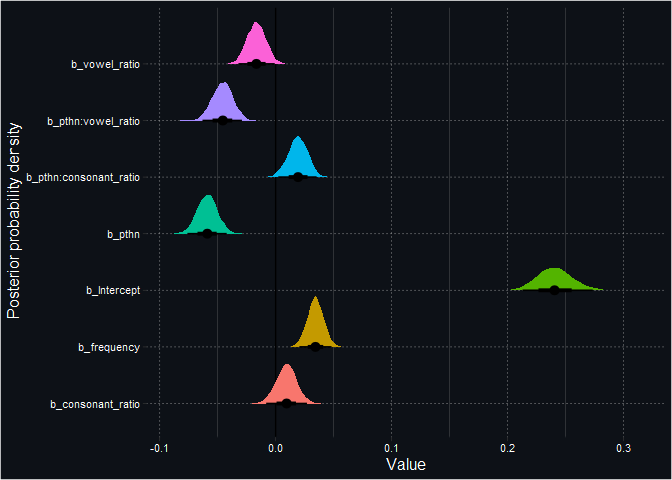
<p class="caption">
Points and error bars in indicate the posterior means, and 50% and 95%
CrI. The intercept has been transformed using the inverse logit to get
the average probability of correct response. The resto of the
coefficients has been transformed using the divide-by-four- rule to get
the maximum change in probability of correct response, associated with a
unit increase in this variable.
</p>

</div>

#### Model comparison

Leave-one-out cross-validation. The more negative is `elpd_diff` (and
the larger its magnitude compared to its corresponding standard error),
the better it first the data compared to the null model
(`~ 1 + (1 | participant)`). The model that fits the data the best is
the extended model.

<div id="rqzhmipbsi" style="overflow-x:auto;overflow-y:auto;width:auto;height:auto;">
<style>html {
  font-family: -apple-system, BlinkMacSystemFont, 'Segoe UI', Roboto, Oxygen, Ubuntu, Cantarell, 'Helvetica Neue', 'Fira Sans', 'Droid Sans', Arial, sans-serif;
}

#rqzhmipbsi .gt_table {
  display: table;
  border-collapse: collapse;
  margin-left: auto;
  margin-right: auto;
  color: #333333;
  font-size: 16px;
  font-weight: normal;
  font-style: normal;
  background-color: #FFFFFF;
  width: auto;
  border-top-style: solid;
  border-top-width: 2px;
  border-top-color: #A8A8A8;
  border-right-style: none;
  border-right-width: 2px;
  border-right-color: #D3D3D3;
  border-bottom-style: solid;
  border-bottom-width: 2px;
  border-bottom-color: #A8A8A8;
  border-left-style: none;
  border-left-width: 2px;
  border-left-color: #D3D3D3;
}

#rqzhmipbsi .gt_heading {
  background-color: #FFFFFF;
  text-align: center;
  border-bottom-color: #FFFFFF;
  border-left-style: none;
  border-left-width: 1px;
  border-left-color: #D3D3D3;
  border-right-style: none;
  border-right-width: 1px;
  border-right-color: #D3D3D3;
}

#rqzhmipbsi .gt_title {
  color: #333333;
  font-size: 125%;
  font-weight: initial;
  padding-top: 4px;
  padding-bottom: 4px;
  border-bottom-color: #FFFFFF;
  border-bottom-width: 0;
}

#rqzhmipbsi .gt_subtitle {
  color: #333333;
  font-size: 85%;
  font-weight: initial;
  padding-top: 0;
  padding-bottom: 6px;
  border-top-color: #FFFFFF;
  border-top-width: 0;
}

#rqzhmipbsi .gt_bottom_border {
  border-bottom-style: solid;
  border-bottom-width: 2px;
  border-bottom-color: #D3D3D3;
}

#rqzhmipbsi .gt_col_headings {
  border-top-style: solid;
  border-top-width: 2px;
  border-top-color: #D3D3D3;
  border-bottom-style: solid;
  border-bottom-width: 2px;
  border-bottom-color: #D3D3D3;
  border-left-style: none;
  border-left-width: 1px;
  border-left-color: #D3D3D3;
  border-right-style: none;
  border-right-width: 1px;
  border-right-color: #D3D3D3;
}

#rqzhmipbsi .gt_col_heading {
  color: #333333;
  background-color: #FFFFFF;
  font-size: 100%;
  font-weight: normal;
  text-transform: inherit;
  border-left-style: none;
  border-left-width: 1px;
  border-left-color: #D3D3D3;
  border-right-style: none;
  border-right-width: 1px;
  border-right-color: #D3D3D3;
  vertical-align: bottom;
  padding-top: 5px;
  padding-bottom: 6px;
  padding-left: 5px;
  padding-right: 5px;
  overflow-x: hidden;
}

#rqzhmipbsi .gt_column_spanner_outer {
  color: #333333;
  background-color: #FFFFFF;
  font-size: 100%;
  font-weight: normal;
  text-transform: inherit;
  padding-top: 0;
  padding-bottom: 0;
  padding-left: 4px;
  padding-right: 4px;
}

#rqzhmipbsi .gt_column_spanner_outer:first-child {
  padding-left: 0;
}

#rqzhmipbsi .gt_column_spanner_outer:last-child {
  padding-right: 0;
}

#rqzhmipbsi .gt_column_spanner {
  border-bottom-style: solid;
  border-bottom-width: 2px;
  border-bottom-color: #D3D3D3;
  vertical-align: bottom;
  padding-top: 5px;
  padding-bottom: 5px;
  overflow-x: hidden;
  display: inline-block;
  width: 100%;
}

#rqzhmipbsi .gt_group_heading {
  padding: 8px;
  color: #333333;
  background-color: #FFFFFF;
  font-size: 100%;
  font-weight: initial;
  text-transform: inherit;
  border-top-style: solid;
  border-top-width: 2px;
  border-top-color: #D3D3D3;
  border-bottom-style: solid;
  border-bottom-width: 2px;
  border-bottom-color: #D3D3D3;
  border-left-style: none;
  border-left-width: 1px;
  border-left-color: #D3D3D3;
  border-right-style: none;
  border-right-width: 1px;
  border-right-color: #D3D3D3;
  vertical-align: middle;
}

#rqzhmipbsi .gt_empty_group_heading {
  padding: 0.5px;
  color: #333333;
  background-color: #FFFFFF;
  font-size: 100%;
  font-weight: initial;
  border-top-style: solid;
  border-top-width: 2px;
  border-top-color: #D3D3D3;
  border-bottom-style: solid;
  border-bottom-width: 2px;
  border-bottom-color: #D3D3D3;
  vertical-align: middle;
}

#rqzhmipbsi .gt_from_md > :first-child {
  margin-top: 0;
}

#rqzhmipbsi .gt_from_md > :last-child {
  margin-bottom: 0;
}

#rqzhmipbsi .gt_row {
  padding-top: 8px;
  padding-bottom: 8px;
  padding-left: 5px;
  padding-right: 5px;
  margin: 10px;
  border-top-style: solid;
  border-top-width: 1px;
  border-top-color: #D3D3D3;
  border-left-style: none;
  border-left-width: 1px;
  border-left-color: #D3D3D3;
  border-right-style: none;
  border-right-width: 1px;
  border-right-color: #D3D3D3;
  vertical-align: middle;
  overflow-x: hidden;
}

#rqzhmipbsi .gt_stub {
  color: #333333;
  background-color: #FFFFFF;
  font-size: 100%;
  font-weight: initial;
  text-transform: inherit;
  border-right-style: solid;
  border-right-width: 2px;
  border-right-color: #D3D3D3;
  padding-left: 12px;
}

#rqzhmipbsi .gt_summary_row {
  color: #333333;
  background-color: #FFFFFF;
  text-transform: inherit;
  padding-top: 8px;
  padding-bottom: 8px;
  padding-left: 5px;
  padding-right: 5px;
}

#rqzhmipbsi .gt_first_summary_row {
  padding-top: 8px;
  padding-bottom: 8px;
  padding-left: 5px;
  padding-right: 5px;
  border-top-style: solid;
  border-top-width: 2px;
  border-top-color: #D3D3D3;
}

#rqzhmipbsi .gt_grand_summary_row {
  color: #333333;
  background-color: #FFFFFF;
  text-transform: inherit;
  padding-top: 8px;
  padding-bottom: 8px;
  padding-left: 5px;
  padding-right: 5px;
}

#rqzhmipbsi .gt_first_grand_summary_row {
  padding-top: 8px;
  padding-bottom: 8px;
  padding-left: 5px;
  padding-right: 5px;
  border-top-style: double;
  border-top-width: 6px;
  border-top-color: #D3D3D3;
}

#rqzhmipbsi .gt_striped {
  background-color: rgba(128, 128, 128, 0.05);
}

#rqzhmipbsi .gt_table_body {
  border-top-style: solid;
  border-top-width: 2px;
  border-top-color: #D3D3D3;
  border-bottom-style: solid;
  border-bottom-width: 2px;
  border-bottom-color: #D3D3D3;
}

#rqzhmipbsi .gt_footnotes {
  color: #333333;
  background-color: #FFFFFF;
  border-bottom-style: none;
  border-bottom-width: 2px;
  border-bottom-color: #D3D3D3;
  border-left-style: none;
  border-left-width: 2px;
  border-left-color: #D3D3D3;
  border-right-style: none;
  border-right-width: 2px;
  border-right-color: #D3D3D3;
}

#rqzhmipbsi .gt_footnote {
  margin: 0px;
  font-size: 90%;
  padding: 4px;
}

#rqzhmipbsi .gt_sourcenotes {
  color: #333333;
  background-color: #FFFFFF;
  border-bottom-style: none;
  border-bottom-width: 2px;
  border-bottom-color: #D3D3D3;
  border-left-style: none;
  border-left-width: 2px;
  border-left-color: #D3D3D3;
  border-right-style: none;
  border-right-width: 2px;
  border-right-color: #D3D3D3;
}

#rqzhmipbsi .gt_sourcenote {
  font-size: 90%;
  padding: 4px;
}

#rqzhmipbsi .gt_left {
  text-align: left;
}

#rqzhmipbsi .gt_center {
  text-align: center;
}

#rqzhmipbsi .gt_right {
  text-align: right;
  font-variant-numeric: tabular-nums;
}

#rqzhmipbsi .gt_font_normal {
  font-weight: normal;
}

#rqzhmipbsi .gt_font_bold {
  font-weight: bold;
}

#rqzhmipbsi .gt_font_italic {
  font-style: italic;
}

#rqzhmipbsi .gt_super {
  font-size: 65%;
}

#rqzhmipbsi .gt_footnote_marks {
  font-style: italic;
  font-weight: normal;
  font-size: 65%;
}
</style>
<table class="gt_table">
  
  <thead class="gt_col_headings">
    <tr>
      <th class="gt_col_heading gt_columns_bottom_border gt_left" rowspan="1" colspan="1"></th>
      <th class="gt_col_heading gt_columns_bottom_border gt_right" rowspan="1" colspan="1"><strong>ELPD</strong></th>
      <th class="gt_col_heading gt_columns_bottom_border gt_right" rowspan="1" colspan="1"><em><strong>SE</strong></em></th>
      <th class="gt_col_heading gt_columns_bottom_border gt_right" rowspan="1" colspan="1"><strong>diff</strong></th>
      <th class="gt_col_heading gt_columns_bottom_border gt_right" rowspan="1" colspan="1"><strong><em>SE</em> diff</strong></th>
    </tr>
  </thead>
  <tbody class="gt_table_body">
    <tr><td class="gt_row gt_left gt_stub">Model 4</td>
<td class="gt_row gt_right">&minus;4,269.75</td>
<td class="gt_row gt_right">45.74</td>
<td class="gt_row gt_right">-</td>
<td class="gt_row gt_right">-</td></tr>
    <tr><td class="gt_row gt_left gt_stub">Model 3</td>
<td class="gt_row gt_right">&minus;4,278.05</td>
<td class="gt_row gt_right">45.47</td>
<td class="gt_row gt_right">&minus;8.30</td>
<td class="gt_row gt_right">5.35</td></tr>
    <tr><td class="gt_row gt_left gt_stub">Model 2</td>
<td class="gt_row gt_right">&minus;4,283.40</td>
<td class="gt_row gt_right">45.56</td>
<td class="gt_row gt_right">&minus;13.65</td>
<td class="gt_row gt_right">5.01</td></tr>
    <tr><td class="gt_row gt_left gt_stub">Model 1</td>
<td class="gt_row gt_right">&minus;4,287.03</td>
<td class="gt_row gt_right">45.36</td>
<td class="gt_row gt_right">&minus;17.28</td>
<td class="gt_row gt_right">6.82</td></tr>
    <tr><td class="gt_row gt_left gt_stub">Model 0</td>
<td class="gt_row gt_right">&minus;4,305.14</td>
<td class="gt_row gt_right">45.32</td>
<td class="gt_row gt_right">&minus;35.39</td>
<td class="gt_row gt_right">9.59</td></tr>
  </tbody>
  
  
</table>
</div>

#### Random effects

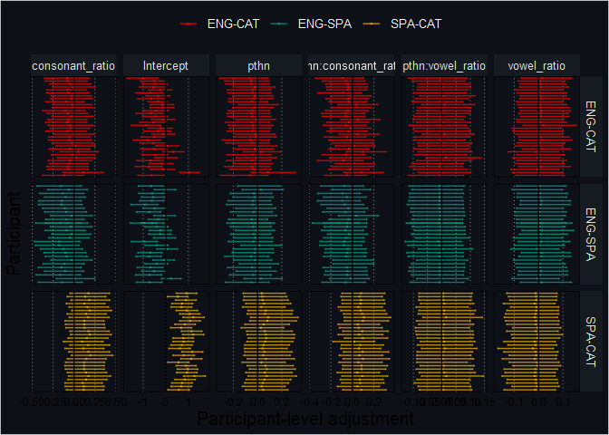

#### Marginal effects

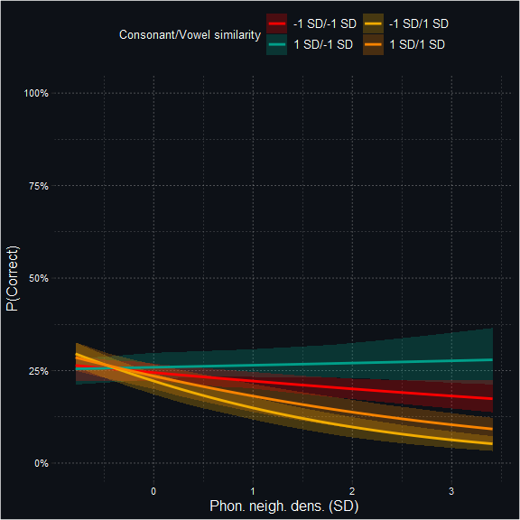

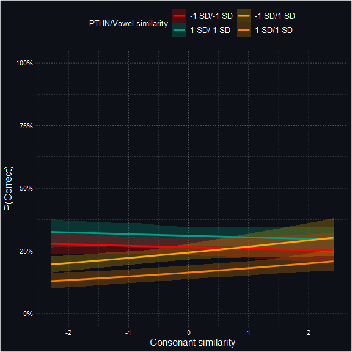

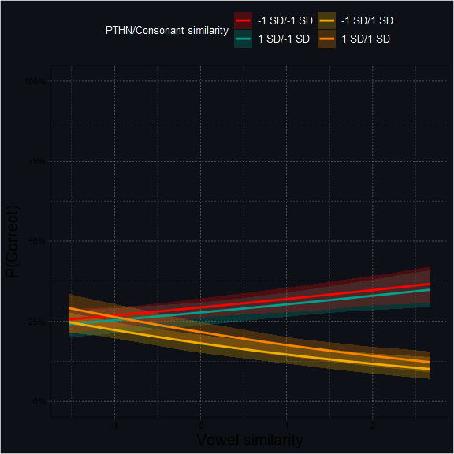

#### 

### Accuracy by item

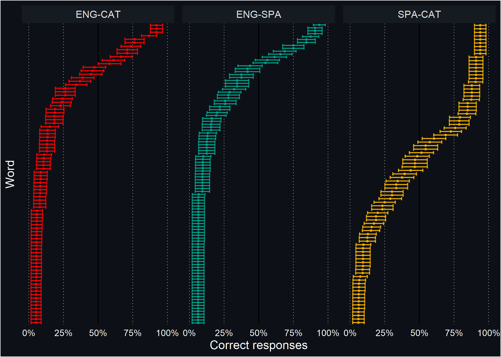

### Accuracy by participant

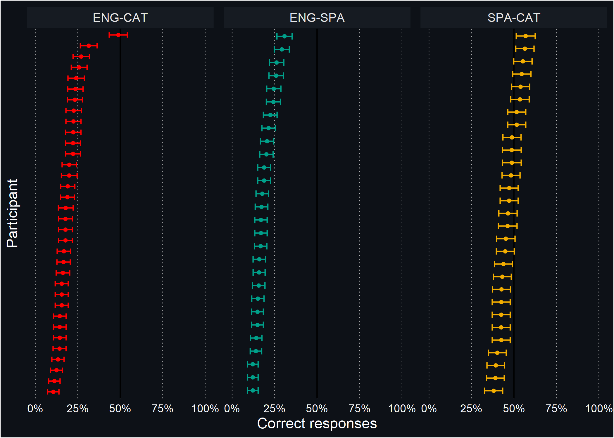

### 

## 

# 

# References

<div id="refs" class="references csl-bib-body hanging-indent">

<div id="ref-burkner2017brms" class="csl-entry">

Bürkner, Paul-Christian. 2017. “Brms: An r Package for Bayesian
Multilevel Models Using Stan.” *Journal of Statistical Software* 80 (1):
1–28.

</div>

<div id="ref-carpenter2017stan" class="csl-entry">

Carpenter, Bob, Andrew Gelman, Matthew D Hoffman, Daniel Lee, Ben
Goodrich, Michael Betancourt, Marcus A Brubaker, Jiqiang Guo, Peter Li,
and Allen Riddell. 2017. “Stan: A Probabilistic Programming Language.”
*Grantee Submission* 76 (1): 1–32.

</div>

<div id="ref-van2011mice" class="csl-entry">

van Buuren, Stef, and Karin Groothuis-Oudshoorn. 2011. “<span
class="nocase">mice</span>: Multivariate Imputation by Chained Equations
in r.” *Journal of Statistical Software* 45 (3): 1–67.
<https://www.jstatsoft.org/v45/i03/>.

</div>

<div id="ref-loo2014stringdist" class="csl-entry">

van der Loo, M. P. J. 2014. “The Stringdist Package for Approximate
String Matching.” *The R Journal* 6: 111–22.
<https://CRAN.R-project.org/package=stringdist>.

</div>

</div>

[1] We originally planned to exclude participants that reported any
visual impairment that glasses would not correct. This item was phrased
as Do you have normal or corrected-to-normal VISION? (Yes/No) in
English, and as ¿Tienes problemas de VISIÓN que unas gafas o lentes de
contacto NO corrijan? (Sí/No). Surprisingly, the proportion of Spanish
participants that reported visual impairment was implausibly large (n =
6, 18.18%). This is possibly due to some participants using glasses
daily and not having read the item until the end, where it is indicated
that the use of glasses is considered as normal vision
