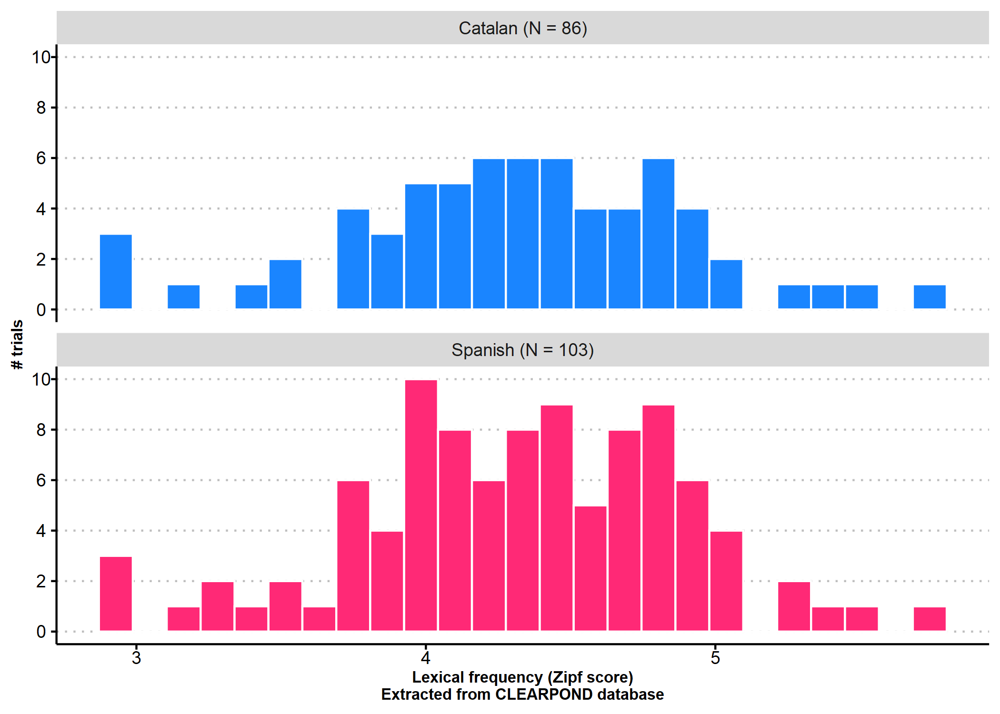
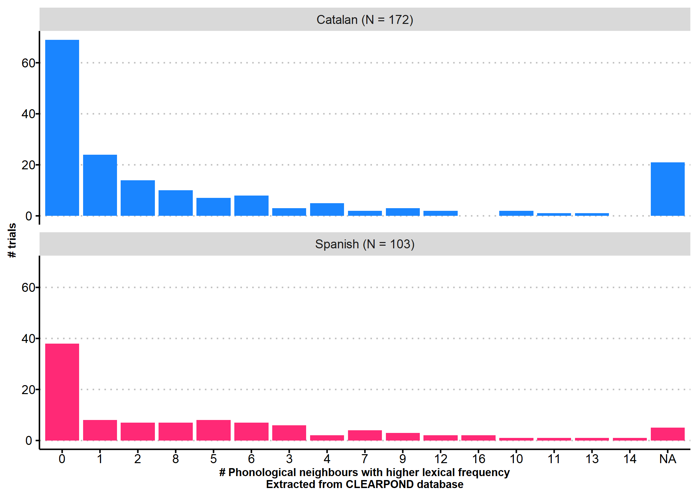
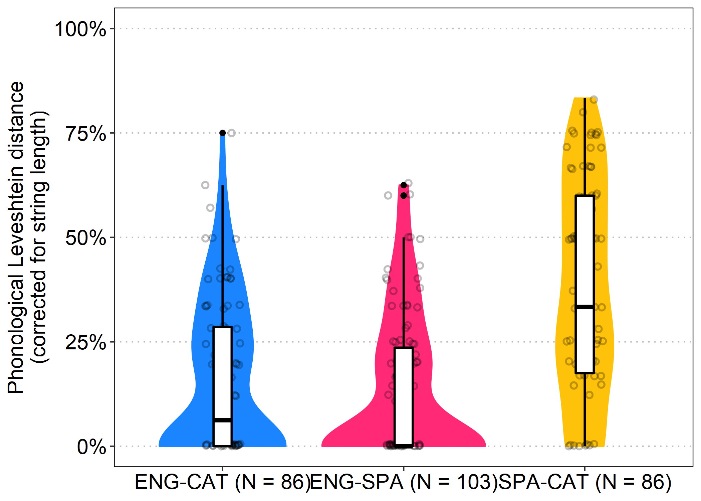

# Overview

Participants in the ENG-SPA listened to 103 Spanish words, and
participants in the ENG-CAT and the SPA-CAT groups listened to 86
trials. Five trials in each condition were practice trials and were
excluded from analyses.

# Lexical frequency

# PTHN

# Phonological similarity

