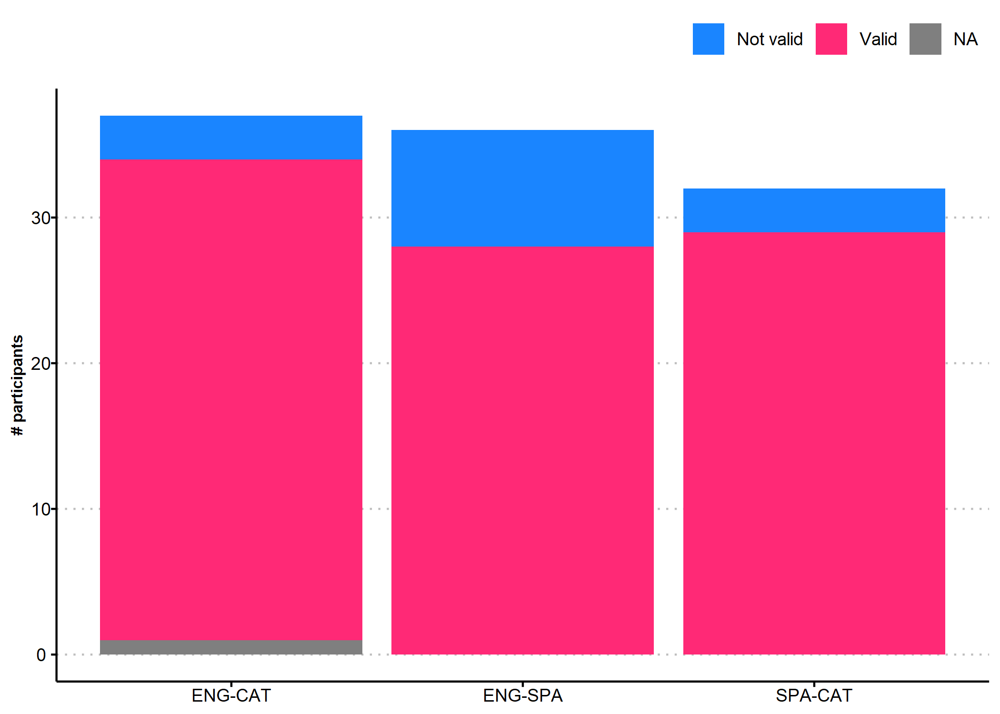
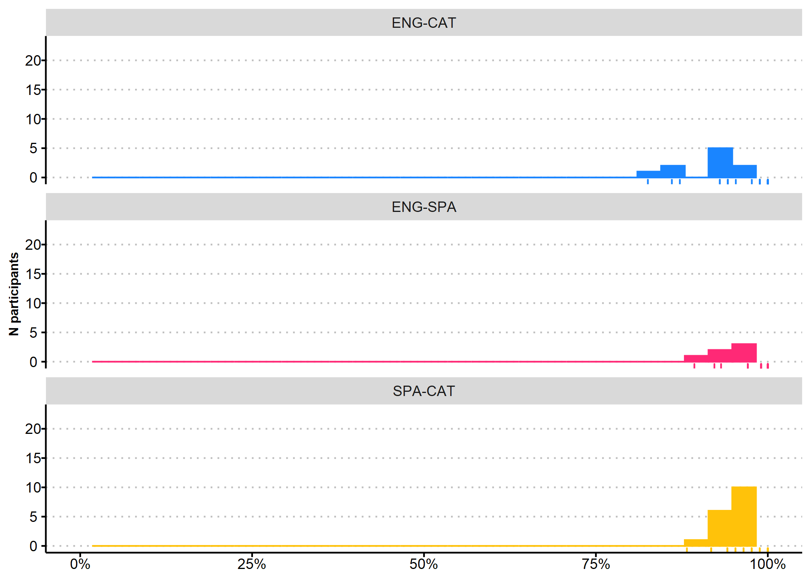
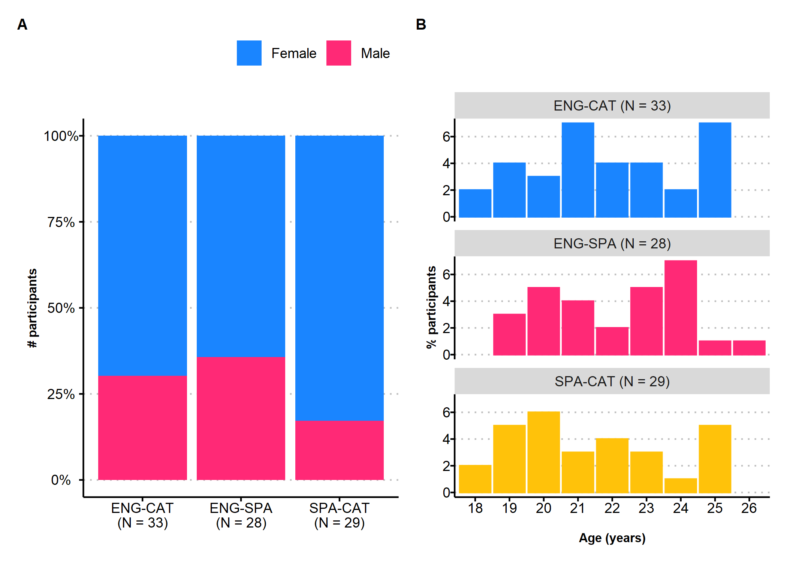
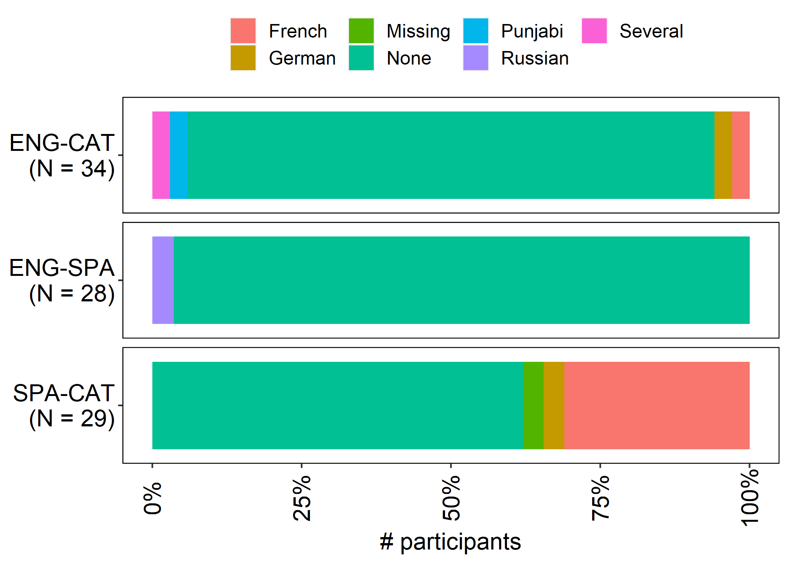
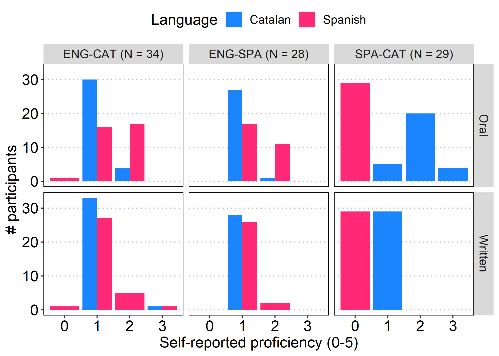

We collected data from June 04th 2020 to June 28th 2020. We tested 104
participants. 36 were English natives tested in Spanish, 36 were English
natives tested in Catalan, and 33 were Spanish natives tested in
Catalan. 14 failed to meet all the inclusion criteria and were excluded
from further analyses. The final sample comprised data from 14
participants, 28 in the ENG-SPA group, 33 in the ENG-CAT group, and 30
in the SPA-CAT group.

Participants were included if[1]:

-   Aged 18 to 25 years
-   Did not report being fluent in Catalan, Spanish, or Italian
-   Provided at least 80% of the presented trials
-   Did not report motor, auditory or visual (other than wearing
    glasses) problems

Trials were considered valid if:

-   Participant did not leave a blank response
-   Participant took longer than 10 seconds to respond

# Summary

# Valid trials

# Demographic information

# Second language

# Language profile proficiency

[1] We originally planned to exclude participants that reported any
visual impairment that glasses would not correct. This item was phrased
as Do you have normal or corrected-to-normal VISION? (Yes/No) in
English, and as ¿Tienes problemas de VISIÓN que unas gafas o lentes de
contacto NO corrijan? (Sí/No). Surprisingly, the proportion of Spanish
participants that reported visual impairment was implausibly large (n =
6, 18.18%). This is possibly due to some participants using glasses
daily and not having read the item until the end, where it is indicated
that the use of glasses is considered as normal vision
