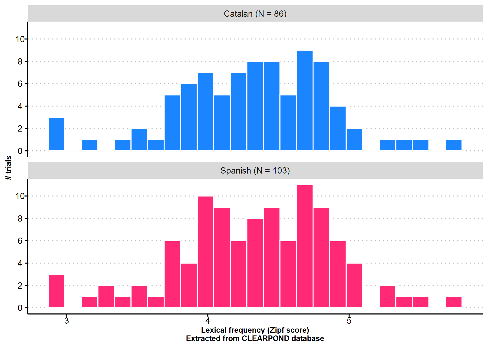
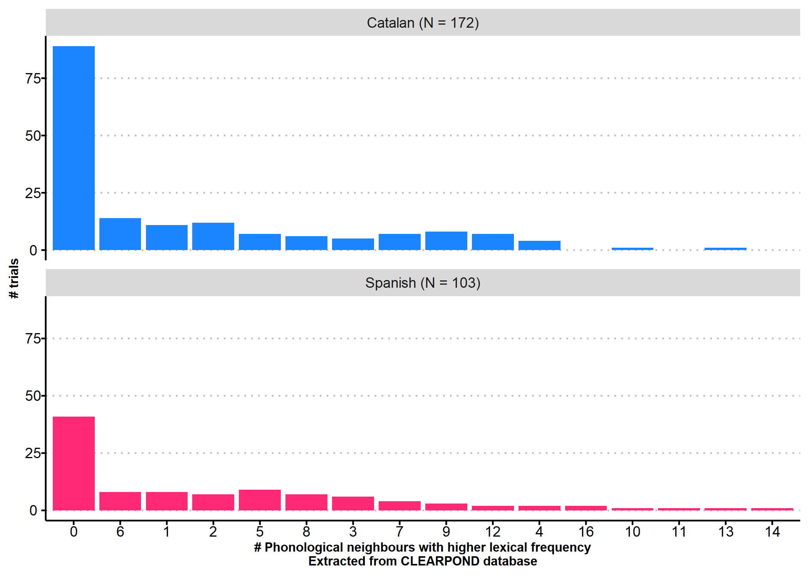
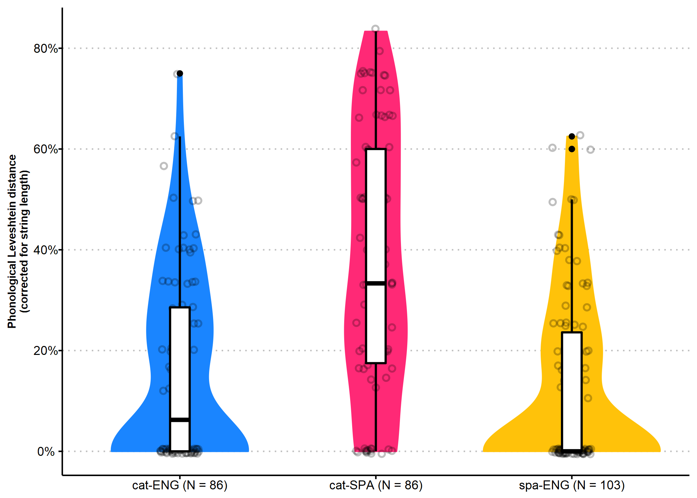
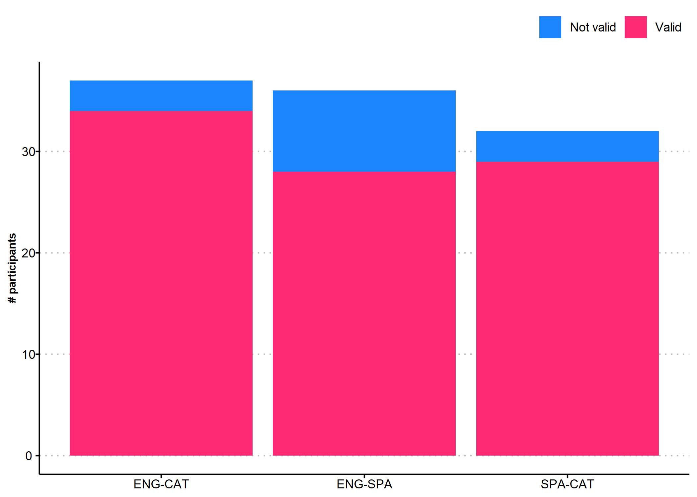
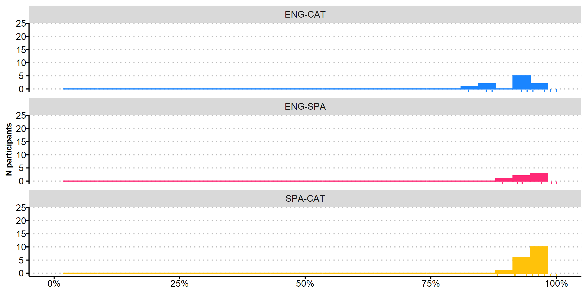
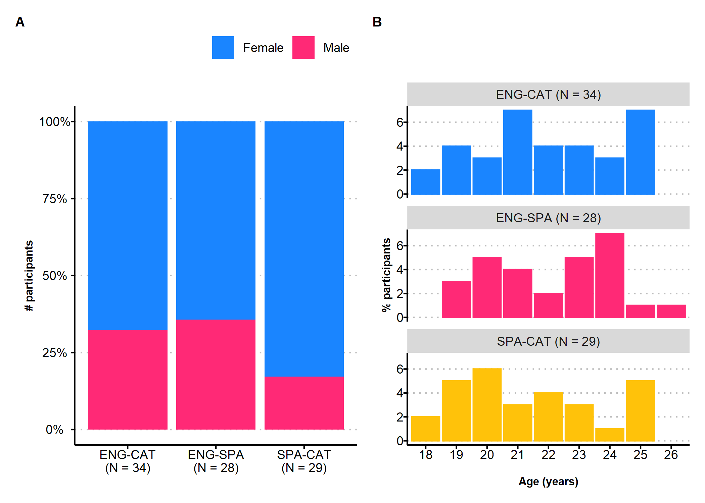
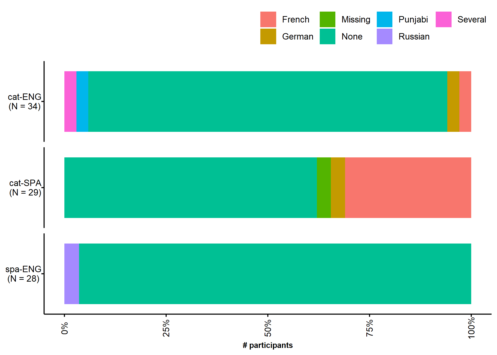
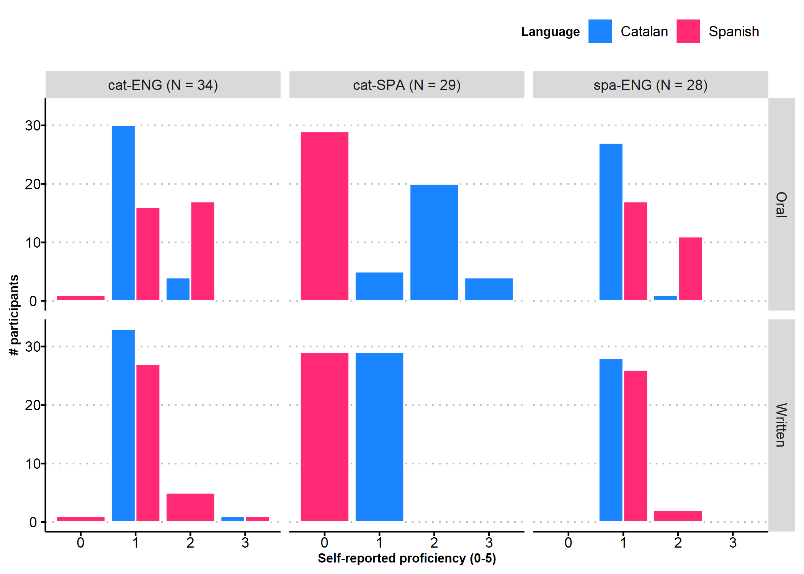
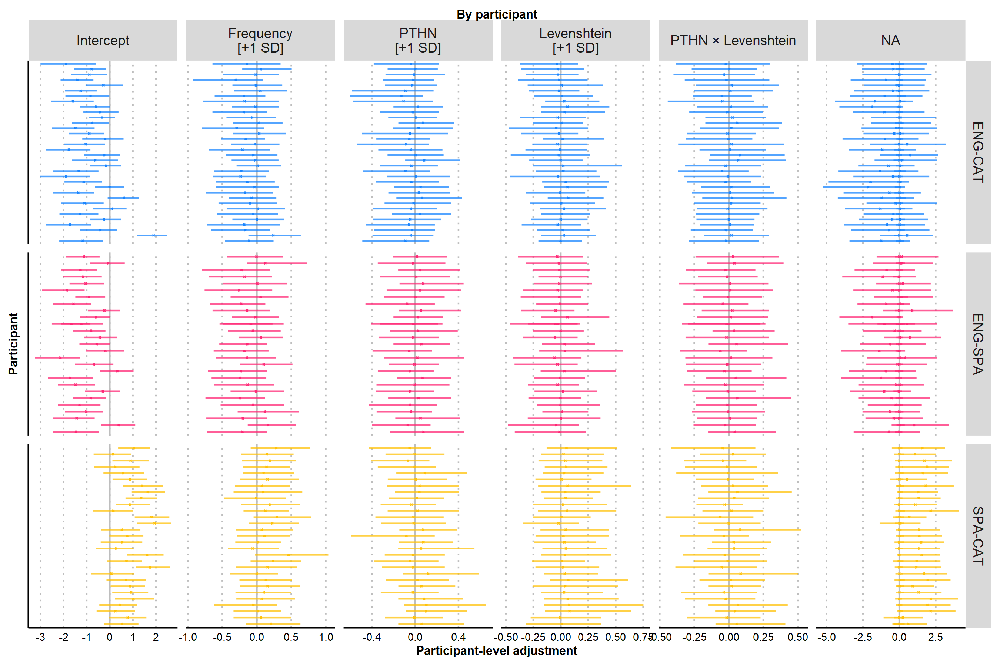
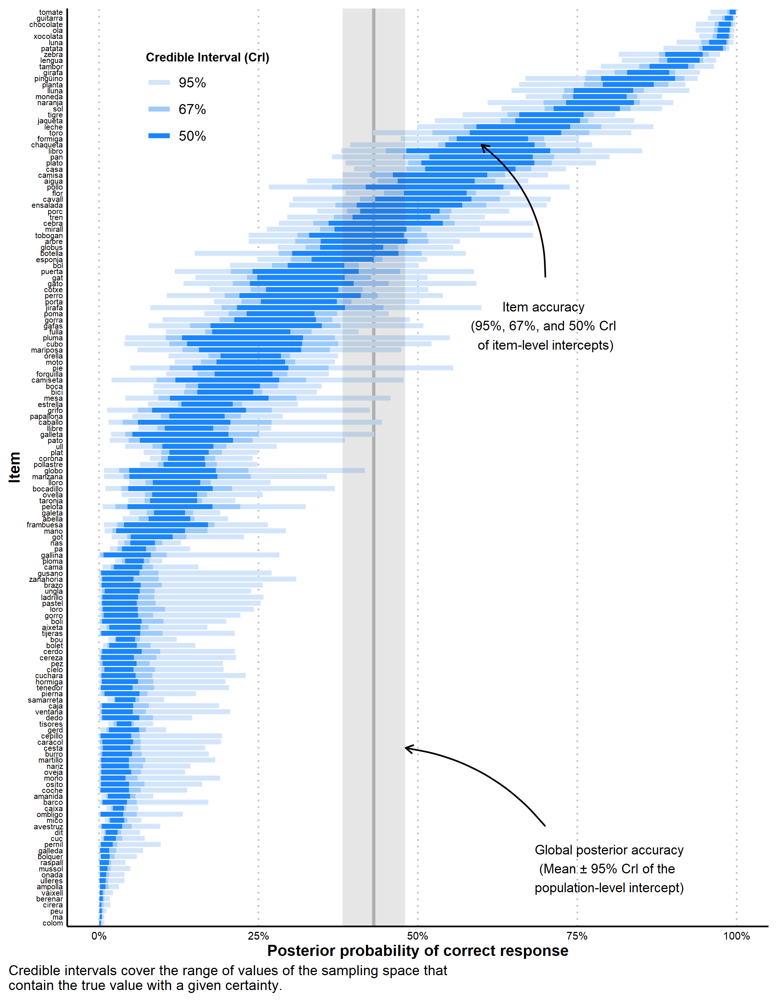

# Stimuli 

## Summary

Participants in the ENG-SPA listened to 103 Spanish words, and participants in the ENG-CAT and the SPA-CAT groups listened to 86 trials. Five trials in each condition were practice trials and were excluded from analyses.

preserve842b5930d134dcdd

## Lexical frequency

## PTHN

## Levenshtein distance

## Distributions

Distribution and summary statistics of stimuli translations, plotted in different panels for English translations of Catalan stimuli (cat-ENG), English translations of Spanish stimuli (spa-ENG), and Spanish translation of Catalan stimuli (cat-SPA). A\) Lexical frequency of stimuli translations, expressed in counts per million and as Zipf scores. B\) Number of higher-frequency phonological neighbourhoods (PTHN) of stimuli translations. C\) Normalised Levenshtein phonological similarity between the presented stimuli and their translations, expressed in percentages. Lexical frequencies and PTHN scores of the stimuli (presented auditorily in Catalan or Spanish) are not described, as participants lack any lexical representation of such words.

# Participants

We collected data from June 04th 2020 to June 28th 2020. We tested 104 participants. 36 were English natives tested in Spanish, 37 were English natives tested in Catalan, and 32 were Spanish natives tested in Catalan. 14 failed to meet all the inclusion criteria and were excluded from further analyses. The final sample comprised data from 14 participants, 28 in the ENG-SPA group, 34 in the ENG-CAT group, and 29 in the SPA-CAT group.

Participants were included if^[We originally planned to exclude participants that reported any visual impairment that glasses would not correct. This item was phrased as Do you have normal or corrected-to-normal VISION? (Yes/No) in English, and as ¿Tienes problemas de VISIÓN que unas gafas o lentes de contacto NO corrijan? (Sí/No). Surprisingly, the proportion of Spanish participants that reported visual impairment was implausibly large (n = 6, 18.18%). This is possibly due to some participants using glasses daily and not having read the item until the end, where it is indicated that the use of glasses is considered as normal vision]:

* Aged 18 to 25 years
* Did not report being fluent in Catalan, Spanish, or Italian
* Provided at least 80% of the presented trials
* Did not report motor, auditory or visual (other than wearing glasses) problems

Trials were considered valid if:

* Participant did not leave a blank response
* Participant took longer than 10 seconds to respond

## Summary

## Valid trials

## Demographic information

## Second language

## Language profile proficiency

# Data analysis

We fitted a Bayesian multilevel regression model using the R package `brms` [@burkner2017brms], with correct responses (`correct`, 0 is incorrect response, 1 if correct response) as the response variable with a Bernoulli distribution and a logit link function. We modelled the probability of an average participant providing a correct response, conditional to a set of predictors (aka. fixed effects) and their interactions:

* PTHN (`pthn`, 0-Inf): number of phonological neighbours with higher frequency of the target word. Extracted from the CLEARPOND database. Standardised before entering the regression model.
* Phonological similarity (`lv`, 0-1): Inverse Levenshtein distance between the IPA transcription of the presented word and its correct translation in the target language, calculated using the `stringdist` function of the `stringdist` package [@loo2014stringdist]. Standardised before entering the regression model.
* Shared phonological onset (`onset`, Same/Different): Whether the presented and the target word share phonological onset, as judged by experimenters, and sum coded as $Different = -0.5$ and $Same = +0.5$. 

We added participants (`participants`) and as a grouping variable (aka., random effects), therefore adding participant-level adjustments to the model. We specified random intercepts slopes for all fixed effects within the `participant` grouping variable.

We performed multiple imputation via predictive mean matching using the `mice` function of the `mice` package [@van2011mice] to impute missing values in the response variable or the predictors. 

The model was implemented using the following formula (`fit_3`):

$$\begin{align}

&\textbf{Likelihood}  \\
y_{i} \sim& Bernoulli(p_{i}) && \text{[probability of correct translation]} \\ \\

&\textbf{Parameters}  \\

logit(p_{i}) = ~ &  \beta_{0[p,w]} ~ +  && \text{[linear model]}\\
& \beta_{1[p]} ~ Frequency_{i} ~ + \\
& \beta_{2[p]} ~ PTHN_i ~ + \\
& \beta_{3[p]} ~ Similarity_i ~ + \\
& \beta_{4[p]} ~ (PTHN_i \times Similarity_i) \\ \\

\beta_{0-6[p,w]} \sim& ~  \mathcal{N}(\mu_{\beta_{j}}, \sigma_{\beta_{j}}) \text{, for participant } p ~\text{in 1, ..., } P ~\text{and  word } w ~\text{in 1, ..., } W && \text{[participant- and word-level intercepts]} \\
\beta_{1-6[p]} \sim& ~  \mathcal{N}(\mu_{\beta_{j}}, \sigma_{\beta_{j}}) \text{, for participant } p ~\text{in 1, ..., } P
&& \text{[participant-level coefficients]} \\ \\

&\textbf{Prior}  \\

\mu_{\beta_{p,w}} ~ \sim& ~ \mathcal{N}(0, 0.1) && \text{[participant-level coefficients]} \\
\sigma_{\beta_{p}}, ~ \sigma_{\beta_{w}} \sim& ~ HalfCauchy(0, 0.1) && \text{[SD for population and participant]} \\
\rho_{p}, ~ \rho_{w} \sim& ~LKJ(8) && \text{[correlation between participant-level coefficients]} \\

\end{align}$$

The estimation of the model was performed using Bayesian inference via Hamiltonian Monte-Carlo in Stan [@carpenter2017stan], with 4 chains, 2,000 iterations each (1,000 warm-ups iterations). The output of this model is the approximated posterior distribution of all the parameters estimated, therefore indicating the probability of each combination of values of the parameters, conditional to the observed data. 

We compared this (extended model) to other models dropping one predictor at a time using Leave-one-out cross-validation (LOO-CV), using the `loo` and `loo_compare` functions of the `brms` package. We compared our extended model against the following models:

* fit_0: `~ 1 + (1 | participant) + (1 | word)`
* fit_1: `~ 1 + frequency_zipf + (1 + frequency_zipf | participant) + (1 | word)`
* fit_2: `~ 1 + frequency_zipf + pthn + (1 + frequency_zipf + pthn | participant) + (1 | word)`
* fit_3: `~ 1 + frequency_zipf + pthn + lv + (1 + frequency_zipf + pthn + lv | participant) + (1 | word)`
* fit_4: `~ 1 + frequency_zipf + pthn + lv + pthn:lv + (1 + frequency_zipf + pthn + pthn:lv + lv | participant) + (1 | word)`
* fit_5: `~ 1 + frequency_zipf + pthn + lv + pthn:lv + group + (1 + frequency_zipf + pthn + pthn:lv + lv | participant) + (1 | word)`
* fit_6: `~ 1 + frequency_zipf + pthn + lv + pthn:lv + group + group:lv + (1 + frequency_zipf + pthn + pthn:lv + lv | participant) + (1 | word)`

# Results

## Model comparison

Leave-one-out cross-validation. The more negative is `elpd_diff` (and the larger its magnitude compared to its corresponding standard error), the better it first the data compared to the null model (`~ 1 + (1 | participant)`). The model that fits the data the best is the extended model.

preserved517bda4f547a7e7

### Fixed coefficients

preservedf9176d7b5385f0a

Estimated posterior distributions of coefficients in Model 4. A\) Population-level effects. Distributions indicate the estimated posterior likelihood density of regression coefficients of fixed effects. Credible intervals (*CrI*), represented with increasingly lighter segmentents in the distribution indicate the range of values that contain the true value with 95\%, 80\%, and 50\% probability. Black dots represent the mean of each distribution. B\) Participant\-level coefficient variability. The model estimated participant\-level coefficients to account for the dependency between responses from the same participant. Distributions in this panel indicate the estimated variability across coefficients from different participants, expressed as standard deviations (*SD*). C\) Correlation between participant\-level effects. The model allowed participant-level coefficients to co\-vary. This panel represents the Pearson correlations between each pair of coefficients, expressed as the mean of the posterior distribution of each  estimated correlation.

## Random effects

## Marginal effects

Expected mean posterior predictions from Model 4. A) Population-level predictions: the X-axis and the Y-axis represent the PTHN score (in standard deviations from the mean) and the probability of correct translation, respectively. We simulated 300 observations from the posterior distribution of the model: 100 simulations for translations with no similarity (0% Levenshtein), 100 simulations for translations with mean accuracy (20.51% Levenshtein), and 100 simulations for translations with the maximum observed accuracy (83.33% Levenshtein). We did this across the range of values of the PTHN scores. For each simulation, we drew a single sample from the posterior distribution of each coefficient. Each simulation is depicted in the graph as a line: pink for minimum similarity translations, blue for hight similarity translations, and yellow for maximum similarity translations. Black, thick lines indicate the expected mean value of the posterior predictions of the model for each condition. The dispersion of the lines indicates the uncertainty of our predictions. We computed these posterior predictions for each group of participants, and plot tem in separate panels.

